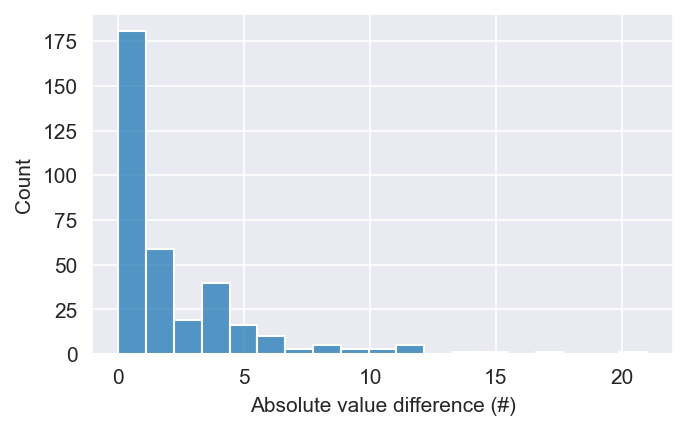

## Inspiration

## What it does

This AI predicts the number of accidents per month on any street given the the quality of the road and circumstantial factors such as weather, speed limits. This enables it to predict which factors contribute to an increase in risk, which help detect fixable anomalies (ex. incorrect road signs and lights).

## How we built it

This AI regression model is a sequential neuronal network which is using eight dense layers and containing around 17k neurons. The model is built and trained on the tensorflow framework over a dataset that was derived by taking multiple datasets in donneesquebec.ca and combining them using complex algorithms.

## Challenges we ran into

Compiling the dataset and training the AI model was far from easy. First, some of the important data did not match exactly in different datasets (ex. street names). To solve this problem, we had to design an algorithm that detects whether the two street name are similar enough to know that it is indeed the same street.
Second, choosing a model structure that will enable accurate and fast prediction was another challenge that we faced. We tried many, many possible models, ranging from decision trees (XGBoost algorithm) to Deep Neuronal Networks, and fine-tuned them until the were being performant enough.

## Accomplishments that we're proud of

- We were able to combine multiple datasets into a single dataset of features for every road every month.
- We were able to develop a machine learning model that has some success in accurately predicting the number of accidents per month on a specific road.

## What we learned

- Getting features for machine learning is HARD!!!
- We learned how to use deep neural networks.

## What's next for Riscar-AI

- Firstly, it would be nice to see if it is possible to increase the accuracy with our current dataset.
- Then we could try to see if it is possible to change our solution to predict the number of collisions per year or per day 
- Finally, we could use the model's predictive abilities to predict how changes like different weather situations due to climate change or different speed limits would affect collision rates